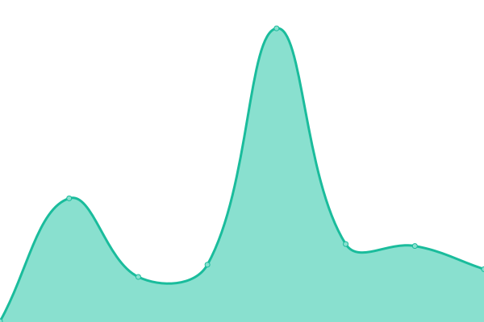

# [📈 Live Status](https://status.motimateapp.com): <!--live status--> **🟥 Complete outage**

This repository contains the open-source uptime monitor and status page for [Motimate](https://status.motimateapp.com), powered by [Upptime](https://github.com/upptime/upptime).

With [Upptime](https://upptime.js.org), you can get your own unlimited and free uptime monitor and status page, powered entirely by a GitHub repository. We use [Issues](https://github.com/Motimate/status/issues) as incident reports, [Actions](https://github.com/Motimate/status/actions) as uptime monitors, and [Pages](https://status.motimateapp.com) for the status page.

<!--start: status pages-->
<!-- This summary is generated by Upptime (https://github.com/upptime/upptime) -->
<!-- Do not edit this manually, your changes will be overwritten -->
<!-- prettier-ignore -->
| URL | Status | History | Response Time | Uptime |
| --- | ------ | ------- | ------------- | ------ |
|  [Web application](https://web.motimateapp.com/) | 🟥 Down | [web-application.yml](https://github.com/Motimate/status/commits/HEAD/history/web-application.yml) | 

 482ms
     
 | 

<a href="https://status.motimateapp.com/history/web-application">99.59%</a>
    

|  [About page](https://about.motimateapp.com/) | 🟥 Down | [about-page.yml](https://github.com/Motimate/status/commits/HEAD/history/about-page.yml) | 

 670ms
     
 | 

<a href="https://status.motimateapp.com/history/about-page">99.59%</a>
    

<!--end: status pages-->

[**Visit our status website →**](https://status.motimateapp.com)

## 📄 License

- Powered by: [Upptime](https://github.com/upptime/upptime)
- Code: [MIT](./LICENSE) © [Motimate](https://status.motimateapp.com)
- Data in the `./history` directory: [Open Database License](https://opendatacommons.org/licenses/odbl/1-0/)
